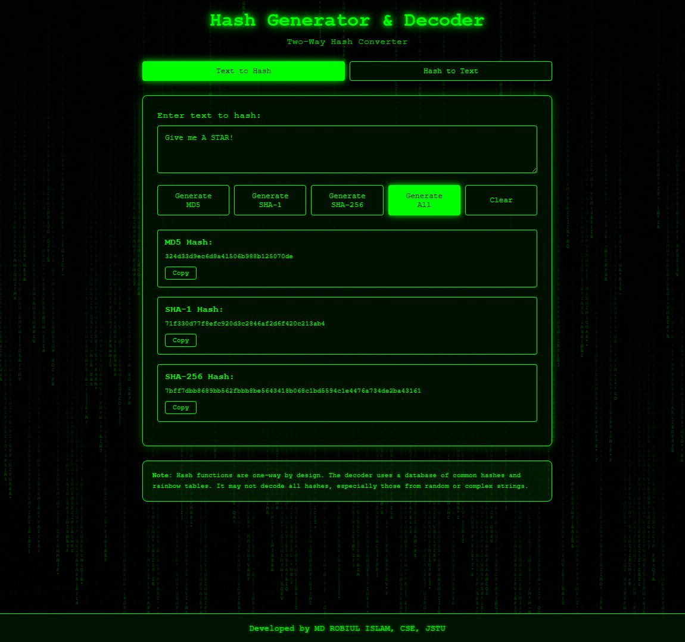

# 🔐 Hash Generator & Decoder - Matrix Style

A powerful web-based hash generator and decoder with a stunning Matrix rain effect. Generate MD5, SHA-1, and SHA-256 hashes instantly, or attempt to decode hashes using our rainbow table lookup system.


## ✨ Features

### 🎯 Core Functionality
- **Multi-Algorithm Support**: Generate MD5, SHA-1, and SHA-256 hashes
- **Two-Way Conversion**: Encode text to hash and decode hashes (using rainbow tables)
- **Batch Processing**: Generate all hash types with one click
- **Real-time Processing**: Instant hash generation with no server requests
- **Hash Auto-Detection**: Automatically detects hash type based on length

### 🎨 User Interface
- **Matrix Rain Effect**: Authentic falling code animation like The Matrix movie
- **Dark Theme**: Eye-friendly green-on-black terminal aesthetic
- **Responsive Design**: Works perfectly on desktop, tablet, and mobile devices
- **Smooth Animations**: Glowing text effects and smooth transitions
- **Toast Notifications**: Visual feedback for all actions

### ⚡ Advanced Features
- **Copy to Clipboard**: One-click copy with visual confirmation
- **Keyboard Shortcuts**:
  - `Ctrl/Cmd + Enter`: Generate all hashes / Decode hash
  - `Ctrl/Cmd + Shift + C`: Clear current form
  - `Ctrl/Cmd + 1`: Switch to Encode mode
  - `Ctrl/Cmd + 2`: Switch to Decode mode
- **Smart Paste Detection**: Auto-detects hash type when pasting
- **Local Storage**: Remembers your preferences (coming soon)
- **Export Results**: Download hash results as JSON/TXT (coming soon)

### 🔧 Technical Features
- **Pure JavaScript**: No backend required, runs entirely in browser
- **Modular Architecture**: Separated HTML, CSS, and JavaScript files
- **Cross-Browser Compatible**: Works on all modern browsers
- **Lightweight**: Fast loading with minimal dependencies
- **Secure**: All processing done client-side, no data sent to servers

## 🚀 Live Demo

[View Live Demo](https://roobiul.github.io/hash_converter/)



## 🛠️ Installation

1. Clone the repository:
```bash
git clone https://github.com/yourusername/hash-generator.git
cd hash-generator


